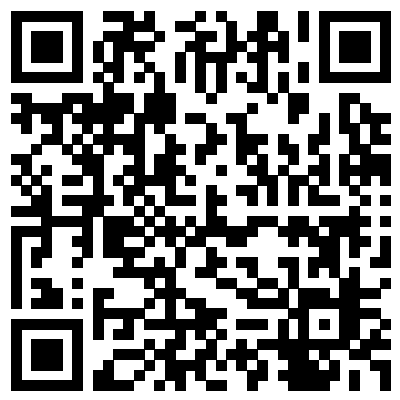

# My Banking App Tests

This is the test repo for the "My Banking App", created for the 
[**Test Automation Day Online | Financial Services**](https://saucelabs.com/community/events/test-automation-day-online-financial-services-2021)
on Nov 17th 08:00 AM, 2021 (UTC-07:00).

You will find all needed test examples for Android and iOS, including the Apps.

## Getting Started
In order to run the tests you must complete the following prerequisite steps:
* Install [Git](#install-git)
* Install [Node/NPM](#install-and-nodejs-and-npm)
* (Optional) Install an IDE

### Install Git
[Git](https://git-scm.com/doc) is a version control system that lets you check out code from a repository,
work with that code on your own branch, and then merge that code with any changes that have been made by other developers.
Git is an essential tool for distributed development teams, and is a critical component of the continuous
integration/continuous development toolchain.

##### MacOSX:
1. Go to [https://git-scm.com/downloads](https://git-scm.com/downloads).
2. Under **Downloads**, click **Mac OS X**.
3. When the download completes, double-click the `.dmg` file open the installer package.
4. Double-click the installer package to begin the installation.
   > *Security Warning*
   >
   > You may see a warning message that the package can't be opened because it's not from a recognized developer.
   If this happens, go to System Preferences > Security and Privacy Settings, and click Open Anyway.
5. Click **Continue** for the installation, and enter your local password to authorize the installation.

##### Windows:
1. Go to [https://git-scm.com/downloads](https://git-scm.com/downloads)
2. Under **Downloads**, click on **Windows**.
3. When the dialog opens asking if you want to allow the app to make changes to your device, click Yes.
4. Follow the steps in the setup wizard to complete the installation. You should accept all the default settings.

### Install and NodeJS and NPM
You’ll need [Node.js](http://nodejs.org) installed.

- Install at least v14 or higher as this is the oldest active LTS version

> **NOTE:**\
> If you don't have Node installed, we recommend installing [NVM](https://github.com/creationix/nvm) to assist managing 
> multiple active Node.js versions.

If you don't want to install NVM, but the plain version of NodeJS please follow the following steps:

#### MacOSX:
1. Go to [https://nodejs.org/en/download/](https://nodejs.org/en/download/).
2. Under **LTS**, click **Mac OS Installer X**.
3. When the download completes, double-click the `.pkg` file to open the installer
4. Follow the prompts to complete the installation.

#### Windows:
1. Go to [https://nodejs.org/en/download/](https://nodejs.org/en/download/).
2. Under **LTS**, click **Windows Installer**.
3. When the download completes, double-click the `.msi` file to open the installer
4. Follow the prompts to complete the installation.

### Install dependencies
You can install all dependencies by running the following command

    npm install

This will install all needed dependencies that are listed in the [`package.json`](package.json)-file

> **NOTE:** Make sure you are in root of this project when you execute this command

### Set Environment Variables for Authentication Credentials
This projects relies on the Sauce Labs `username` and `accessKey` that should have been set in the environment variables.
Please check [this](https://docs.saucelabs.com/basics/environment-variables/) document on how to set them.

## The project
### Intro
The tests in this repo will show you how to use:
- [Camera/Image injection](https://docs.saucelabs.com/mobile-apps/features/camera-image-injection/#automated-testing)
- [Biometrics](https://docs.saucelabs.com/mobile-apps/features/biometric-authentication/#automated-testing)

Hopefully all code is documented well enough to guide you through the steps you need to take. The used app can be found
[here](apps).

### Upload apps to Sauce Labs
You can upload the app, which can be found [here](apps) to Sauce Labs by following 
[these](https://docs.saucelabs.com/mobile-apps/live-testing/live-mobile-app-testing/#uploading-an-app) manual
instructions. 

> **NOTE:** Make sure you upload the apps to your preferred data center.

### QR-codes
The app can use 2 different QR-codes, depending on which option you selected in the first screen. When you selected
*Yes* you selected to register based on an existing *registration* which is running on a different device. You need to
use [this](assets/scan-registered-device.png) QR-code for it



Other wise you need to use [this](assets/scan-account.png) QR-code for it


### Android
More information for Android can be found here:
- [Android config](wdio.android.conf.ts)
- [Android Test](test/specs/android.spec.ts)

#### Run Android tests
When you've set up your environment and uploaded the apps you can run your tests by running the following command from 
your terminal

    # For testing on the EU
    npm run test.android.eu
    # For testing on the US
    npm run test.android.us

<details>
    <summary>Click to expand and see the Android logs</summary>

```log
> npm run test.android.eu

> MyBankingAppTests@1.0.0 test.android.eu /Users/wimselles/Sauce/Git/sauce-apps/MyBankingAppTests
> REGION=eu wdio run wdio.android.conf.ts


Execution of 1 workers started at 2021-11-17T12:26:18.688Z

[0-0] RUNNING in com.mybankingapp.MainActivity - /test/specs/android.spec.ts
[0-0] PASSED in com.mybankingapp.MainActivity - /test/specs/android.spec.ts

 "spec" Reporter:
------------------------------------------------------------------
[10.102.48.17:16023 Android 10 #0-0] Running: 10.102.48.17:16023 on Android 10
[10.102.48.17:16023 Android 10 #0-0] Session ID: 5bee4f08-e7fd-43e4-9cf2-89724a65427a
[10.102.48.17:16023 Android 10 #0-0]
[10.102.48.17:16023 Android 10 #0-0] » /test/specs/android.spec.ts
[10.102.48.17:16023 Android 10 #0-0] My Banking app For Android
[10.102.48.17:16023 Android 10 #0-0]    ✓ should be able to register and use BioMetrics
[10.102.48.17:16023 Android 10 #0-0]
[10.102.48.17:16023 Android 10 #0-0] 1 passing (28.8s)
[10.102.48.17:16023 Android 10 #0-0]
[10.102.48.17:16023 Android 10 #0-0] Check out job at https://app.eu-central-1.saucelabs.com/tests/5bee4f08-e7fd-43e4-9cf2-89724a65427a?auth=c519c92fb4daf816929e61cf089efc92


Spec Files:      1 passed, 1 total (100% completed) in 00:01:55 
```
</details>

### iOS
More information for iOS can be found here:
- [iOS config](wdio.ios.conf.ts)
- [iOS Test](test/specs/ios.spec.ts)

#### Run iOS tests
When you've set up your environment and uploaded the apps you can run your tests by running the following command from
your terminal

    # For testing on the EU
    npm run test.ios.eu
    # For testing on the US
    npm run test.ios.us

<details>
    <summary>Click to expand and see the iOS logs</summary>

```log
> npm run test.ios.eu

> MyBankingAppTests@1.0.0 test.ios.eu /Users/Sauce/Git/sauce-apps/MyBankingAppTests
> REGION=eu wdio run wdio.ios.conf.ts


Execution of 1 workers started at 2021-11-17T12:24:49.057Z

[0-0] RUNNING in storage:filename=MyBankingApp.ipa - /test/specs/ios.spec.ts
[0-0] PASSED in storage:filename=MyBankingApp.ipa - /test/specs/ios.spec.ts

 "spec" Reporter:
------------------------------------------------------------------
[00008101-001271A40E0B001E iOS 14.8 #0-0] Running: 00008101-001271A40E0B001E on iOS 14.8
[00008101-001271A40E0B001E iOS 14.8 #0-0] Session ID: 15ed6112-ac50-4c79-a488-2b601539c769
[00008101-001271A40E0B001E iOS 14.8 #0-0]
[00008101-001271A40E0B001E iOS 14.8 #0-0] » /test/specs/ios.spec.ts
[00008101-001271A40E0B001E iOS 14.8 #0-0] My Banking app For iOS
[00008101-001271A40E0B001E iOS 14.8 #0-0]    ✓ should be able to register and use BioMetrics
[00008101-001271A40E0B001E iOS 14.8 #0-0]
[00008101-001271A40E0B001E iOS 14.8 #0-0] 1 passing (21.6s)
[00008101-001271A40E0B001E iOS 14.8 #0-0]


Spec Files:      1 passed, 1 total (100% completed) in 00:00:49 
```
</details>
